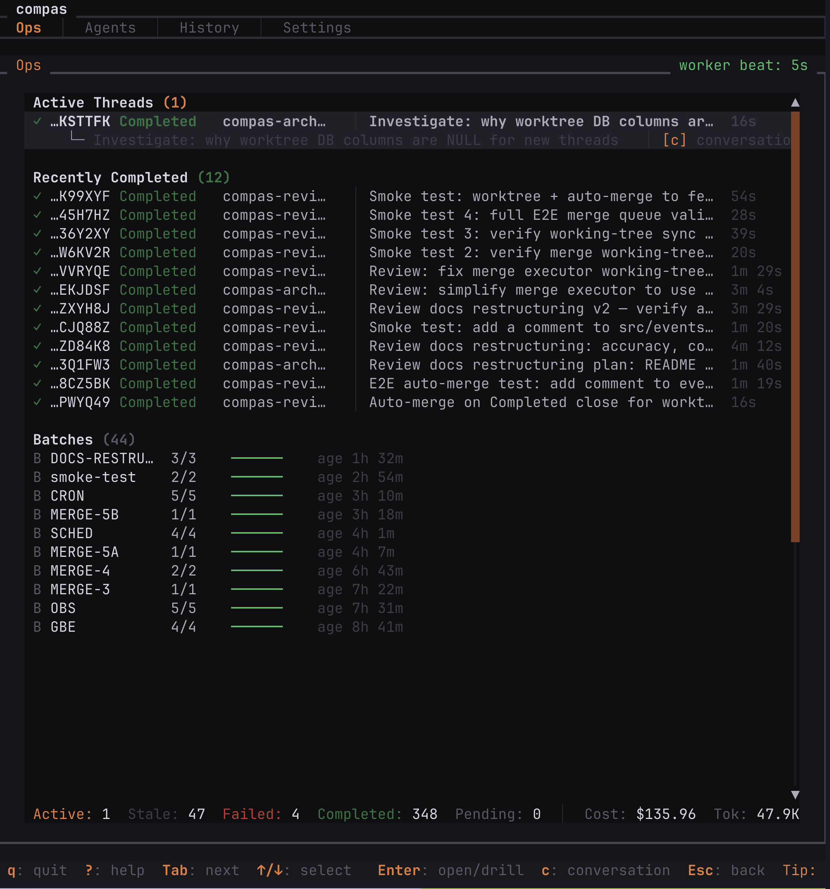
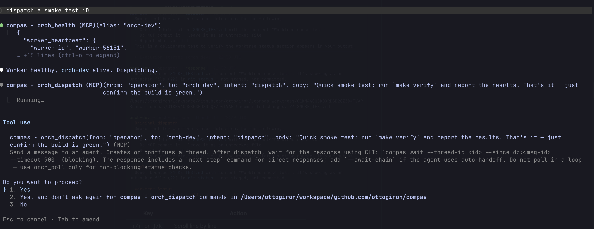
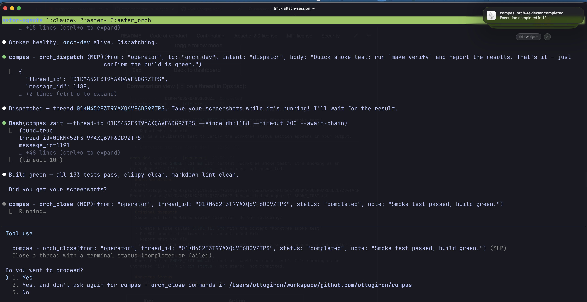

# compas


Multi-agent orchestrator for AI-assisted software development. Dispatch tasks to AI coding agents, monitor execution in a TUI dashboard, and manage the full lifecycle from your terminal.

Works with Claude Code, Codex, Gemini CLI, and OpenCode. Project-agnostic — point it at any repository.

> **Pre-v1 — expect breaking changes.** Configuration format, MCP tool contracts, and CLI flags may change between minor versions. Always install from a [tagged release](https://github.com/ottogiron/compas/tags).



## Prerequisites

- **Rust** toolchain (`cargo`)
- At least one backend CLI installed and authenticated:

| Backend | Install | Authenticate |
| --- | --- | --- |
| Claude Code | `npm install -g @anthropic-ai/claude-code` | `claude login` |
| Codex | `npm install -g @openai/codex` | `codex login` |
| Gemini CLI | `npm install -g @google/gemini-cli` | `gemini auth` |
| OpenCode | See [opencode.ai](https://opencode.ai) | varies by provider |

## Install

Add this to your ~/.cargo/config.toml:

```toml
[net]
git-fetch-with-cli = true
```

Then run

```bash
# you will be asked for github authentication in this step
cargo install --git https://github.com/ottogiron/compas --tag v0.3.0
```

This installs a stable release and puts `compas` on your PATH.

> **Pinning:** Always install from a tagged release. The `main` branch is under active development and may contain incomplete features. Check the [CHANGELOG](CHANGELOG.md) for the latest version.

Or build from source:

```bash
git clone git@github.com:ottogiron/compas.git
cd compas
git checkout v0.2.0   # or the latest tag
cargo build --release
# Binary at target/release/compas — add to PATH or use the full path below
```

### Upgrading

```bash
cargo install --git https://github.com/ottogiron/compas --tag <new-version> --force
```

After upgrading, run `compas doctor` to verify your setup is compatible with the new version. Check the [CHANGELOG](CHANGELOG.md) for breaking changes between versions.

### Uninstalling

```bash
cargo uninstall compas
rm -rf ~/.compas          # remove config and state
```

## Quick Start

### 1. Create a config

```bash
compas init
```

This interactively creates `~/.compas/config.yaml` — detects installed backends, prompts for your repo path and agent settings. Use `--non-interactive` for scripted setups:

```bash
compas init --non-interactive --repo /path/to/project --backend claude
```

### 2. Connect your coding CLI

```bash
compas setup-mcp
```

Auto-detects installed coding tools (Claude Code, Codex, OpenCode, Gemini CLI) and registers compas as an MCP server in all of them. Target a specific tool with `--tool claude`. See `compas setup-mcp --help` for all flags.

### 3. Verify setup

```bash
compas doctor
```

Validates config, backends, worker status, and MCP registration. Reports issues with actionable fix suggestions. Use `--fix` to auto-remediate what it can (e.g., missing MCP registrations).

### 4. Start the dashboard

```bash
compas dashboard
```

The dashboard includes an embedded worker by default. Use `compas dashboard --standalone` for monitoring only (when running the worker separately), or `compas worker` to run the worker as a standalone process.

`--config <path>` is optional on all commands if using the default location (`~/.compas/config.yaml`).

> **Note:** The Gemini backend is stateless — it does not support session resume on follow-up dispatches to the same thread.

<details>
<summary><b>Manual configuration</b> (alternative to <code>compas init</code> + <code>compas setup-mcp</code>)</summary>

Create `~/.compas/config.yaml` manually:

```yaml
default_workdir: /path/to/your/project
state_dir: ~/.compas/state

agents:
  - alias: dev
    backend: claude
    model: claude-sonnet-4-6
    prompt: >
      You are a development agent. Follow the project's AGENTS.md.
```

Supported backends: `claude`, `codex`, `gemini`, `opencode`. See the [Configuration Reference](docs/guides/configuration.md) for all fields.

Register the MCP server manually per tool:

**Claude Code:**

```bash
claude mcp add --scope user --transport stdio compas -- compas mcp-server
```

**Codex:**

```bash
codex mcp add compas -- compas mcp-server
```

**OpenCode** — add to `opencode.json` (project root) or `~/.config/opencode/opencode.json` (global):

```json
{
  "mcp": {
    "compas": {
      "type": "local",
      "command": ["compas", "mcp-server"]
    }
  }
}
```

**Gemini CLI** — add to `.gemini/settings.json`:

```json
{
  "mcpServers": {
    "compas": {
      "command": "compas",
      "args": ["mcp-server"]
    }
  }
}
```

</details>

Only one worker can run at a time. If a worker is already running, the dashboard detects it and skips spawning a second one. Running `compas worker` when another worker is alive fails with an actionable error showing the existing worker's PID.

When the dashboard exits, it sends SIGTERM to the embedded worker, which drains in-flight executions and shuts down. A standalone `compas worker` process is independent and must be stopped separately. Without a running worker, dispatched tasks will queue but not execute.

### 4. Dispatch your first task



From your coding CLI (Claude Code, Codex, Gemini CLI, or OpenCode), just ask it to dispatch work:

> "Dispatch to dev: Add a health check endpoint that returns the current version"

Your CLI uses `orch_dispatch` behind the scenes. You can let it infer the dispatch intent, or name the orchestrator explicitly — both work:

> "Use orch to dispatch to the dev agent: refactor the error handling in src/api.rs to use proper error types"

The agent works in your repo while the dashboard shows progress in real time.



Review the work in the dashboard log viewer (`Enter` on the execution) or ask your CLI:

> "Check the status of my dispatch to dev"
> "Show me the transcript for that thread"

Once you're satisfied with the result:

> "Close that thread as completed"

For multi-step work, continue a conversation on the same thread:

> "Dispatch a follow-up to dev on that thread: now add tests for the health check endpoint"

Group related tasks with batches:

> "Dispatch to dev with batch API-CLEANUP: rename all endpoint handlers to follow the new naming convention"

Check batch progress:

> "Show me the batch status for API-CLEANUP"

### 5. Install the orchestration skill (recommended)

A skill teaches your coding CLI the full dispatch-review-complete workflow. Copy the example skill into your project and install it following your tool's instructions:

```bash
cp -r /path/to/compas/examples/skills/orch-dispatch your-project/skills/
```

The skill covers: worker delegation, reviewer routing, session continuity, worktree isolation, retry behavior, and failure handling. See [examples/skills/orch-dispatch/SKILL.md](examples/skills/orch-dispatch/SKILL.md) for the full reference.

## Dashboard

The TUI dashboard shows real-time orchestrator state across four tabs: **Ops** (active threads, executions, merge queue), **Agents** (health and execution history per agent), **History** (recent executions with batch grouping), and **Settings** (config overview and schedules). Navigate with `Tab`/`1-4`, drill into executions with `Enter`, view thread conversations with `c`, and press `?` for keyboard help.

See the [Dashboard Guide](docs/guides/dashboard.md) for full keyboard shortcuts, tab details, and tips.

## MCP Tools

After dispatching work, use `orch_wait` to block until the agent responds. It sends progress notifications every 10s to prevent transport timeouts. Use `await_chain=true` to wait for the entire handoff/fan-out chain to settle. If `orch_wait` returns `found=false`, re-issue with the same parameters. For non-MCP or scripted-shell workflows, use `compas wait` (CLI equivalent).

**`compas wait` CLI flags:**

| Flag | Description |
| --- | --- |
| `--thread-id <id>` | Thread to wait on (required) |
| `--since <cursor>` | Only match messages newer than this (`db:<msg-id>` or numeric) |
| `--intent <intent>` | Wait for a specific intent (e.g. `response`, `review-request`) |
| `--strict-new` | Only match messages strictly newer than the `--since` cursor |
| `--timeout <secs>` | Timeout in seconds (default: 120) |
| `--await-chain` | Keep waiting until the entire handoff chain settles |

**Exit codes:** `0` = matching message found, `1` = timeout (no match within deadline), `2` = error.

**`compas wait-merge` flags:**

Use `compas wait-merge --op-id <id>` to block until a merge operation reaches a terminal status. The op ID is returned by `orch_merge`.

| Flag | Description |
| --- | --- |
| `--op-id <id>` | Merge operation ID (ULID) to wait on (required) |
| `--timeout <secs>` | Timeout in seconds (default: 120) |
| `--config <path>` | Config file path (default: `~/.compas/config.yaml`) |

**Exit codes:** `0` = completed, `1` = failed/cancelled/timeout, `2` = error (including unknown op ID).

### Core

| Tool | What it does |
| --- | --- |
| `orch_dispatch` | Send a task to an agent (creates a thread, queues execution). Accepts optional `summary` (~80 chars) to label the thread and `scheduled_for` (ISO 8601 timestamp) for delayed execution |
| `orch_close` | Close a thread as `completed` or `failed`. Optionally pass a `merge` object to atomically queue a merge with the close |
| `orch_abandon` | Cancel a thread and its active executions |
| `orch_reopen` | Reopen a closed/failed/abandoned thread |

### Monitor

| Tool | What it does |
| --- | --- |
| `orch_status` | Thread and execution status (filter by agent or thread); includes `scheduled_count` of pending scheduled executions |
| `orch_poll` | Quick non-blocking check for new messages |
| `orch_transcript` | Full conversation history for a thread |
| `orch_read` | Read a single message by reference |
| `orch_batch_status` | Status breakdown for all threads in a batch |
| `orch_tasks` | Execution history with timing and results; `filter="scheduled"` lists only queued executions with a future `eligible_at` |
| `orch_metrics` | Aggregate stats (thread counts, queue depth) |
| `orch_diagnose` | Thread diagnostics with suggested next actions |
| `orch_execution_events` | Structured events from a running/completed execution (tool calls, file edits, tool names) |
| `orch_read_log` | Paginated access to execution log files with offset/limit/tail support |
| `orch_tool_stats` | Per-tool call counts, error rates, and cost breakdown across executions |

### Merge

| Tool | What it does |
| --- | --- |
| `orch_merge` | Queue a merge of a completed thread's branch into a target branch |
| `orch_merge_status` | Query merge operation detail (by op_id) or aggregate overview |
| `orch_merge_cancel` | Cancel a queued merge operation |

### System

| Tool | What it does |
| --- | --- |
| `orch_health` | Worker heartbeat + backend health pings |
| `orch_list_agents` | List configured agents with backend/model info |
| `orch_session_info` | Current MCP session metadata |
| `orch_worktrees` | List active git worktrees for agent isolation |

## Configuration

The default config location is `~/.compas/config.yaml`. Use `--config <path>` to override on any subcommand. A minimal config needs two required fields and at least one agent:

```yaml
default_workdir: /path/to/repo           # Working directory for agents (required)
state_dir: ~/.compas/state               # Runtime state: DB, logs (required)

agents:
  - alias: dev
    backend: claude                      # claude | codex | gemini | opencode
    model: claude-sonnet-4-6
    prompt: "You implement changes. Follow the project's AGENTS.md."
```

Key configuration areas:

- **`orchestration`** — execution timeouts, concurrency limits, trigger intents, merge strategy
- **`agents`** — per-agent backend, model, prompt, workdir, workspace isolation, retry, auto-handoff chains
- **`schedules`** — cron-based recurring dispatches
- **`hooks`** — shell scripts fired on lifecycle events (execution started/completed, thread closed/failed)
- **`backend_definitions`** — wire in any CLI tool as a custom backend via YAML
- **`notifications`** — macOS desktop notifications

The worker hot-reloads `agents`, `schedules`, `hooks`, `trigger_intents`, `max_triggers_per_agent`, `ping_timeout_secs`, `ping_cache_ttl_secs`, `log_retention_count`, and `notifications` without restart.

See the [Configuration Reference](docs/guides/configuration.md) for the full schema and all fields, [`examples/config-generic.yaml`](examples/config-generic.yaml) for a commented starter config, and the [Cookbook](docs/guides/cookbook.md) for real-world patterns (multi-project teams, dev-review-merge loops, scheduled automation, lifecycle hooks, and custom backends).

## How It Works

1. **You dispatch** — ask your CLI to send a task to an agent
2. **Worker claims it** — the background worker picks up the queued execution
3. **Agent executes** — the backend CLI (Claude Code, Codex, Gemini, OpenCode) runs in your repo
4. **Agent replies** — the system assigns `response` intent to all agent replies (agents reply naturally, no protocol overhead)
5. **Auto-handoff** (optional) — if the agent has `on_response` configured, a new handoff message is auto-inserted, triggering the target agent. The chain runs autonomously up to `max_chain_depth`, then forces operator review.
6. **You review** — read the output in the dashboard or via `orch_transcript`
7. **You close** — mark the thread as completed, or dispatch follow-up work

The dashboard shows all of this in real time. For the full architecture, see [docs/project/architecture.md](docs/project/architecture.md).

## Troubleshooting

**Agent not responding?** Ask your CLI:

> "Run orch_health to check the worker"
> "Diagnose that thread"
> "Show me recent tasks and their status"

**Stale state / corrupted DB:**

```bash
# Stop all processes, remove state, restart
kill $(pgrep compas)
rm ~/.compas/state/jobs.sqlite*
compas dashboard
```

**Worker not picking up work:**

- Ask *"Run orch_health"* — is there a recent heartbeat?
- Ask *"Check orch_metrics"* — is `queue_depth > 0`?
- Verify the agent's backend CLI is installed and authenticated (see Prerequisites)

## More Information

- [Configuration Reference](docs/guides/configuration.md) — full schema, agent fields, handoff chains, schedules, hooks, custom backends
- [Dashboard Guide](docs/guides/dashboard.md) — tabs, keyboard shortcuts, tips
- [Cookbook](docs/guides/cookbook.md) — multi-project teams, dev-review-merge loops, scheduled automation, lifecycle hooks, custom backends
- [Architecture & internals](docs/project/architecture.md)
- [Design decisions](docs/project/DECISIONS.md)
- [Development workflow](AGENTS.md)

## Development

```bash
make setup-hooks       # Install pre-commit hook
make verify            # fmt-check + clippy + tests
make dashboard-dev     # Dashboard + worker on isolated dev DB
```

See [AGENTS.md](AGENTS.md) for the full development workflow and [CONTRIBUTING.md](CONTRIBUTING.md) for contribution guidelines.

## License

Licensed under either of [MIT](LICENSE-MIT) or [Apache-2.0](LICENSE-APACHE) at your option.
