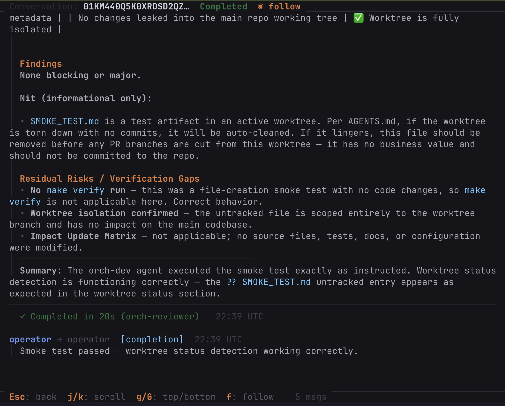

# Dashboard Guide

## Overview

The TUI dashboard shows real-time orchestrator state. Launch it with:

```bash
compas dashboard
```

The dashboard includes an embedded worker by default. Use `compas dashboard --standalone` for monitoring only (when running the worker separately), or `compas worker` to run the worker as a standalone process.

Only one worker can run at a time. If a worker is already running, the dashboard detects it and skips spawning a second one. When the dashboard exits, it sends SIGTERM to the embedded worker, which drains in-flight executions and shuts down. A standalone `compas worker` process is independent and must be stopped separately.

`--config <path>` is optional on all commands if using the default location (`~/.compas/config.yaml`).

## Tabs

### Ops

The primary control-plane view. Shows active work organized into sections:

- **Running** -- executions currently in progress, with live progress summaries
- **Scheduled** -- executions waiting for their scheduled fire time
- **Active Batches** -- batch groups with in-progress executions (drill in with `Enter`, exit with `x`/`Esc`)
- **Active Threads** -- threads with recent activity that are not currently running
- **Merge Queue** -- pending and in-progress merge operations

The status bar at the bottom shows aggregate counts for running, active, and completed work, plus merge queue depth, total cost (USD), and token usage (in/out).

Stale active threads appear dimmed.

### Agents

One card per configured agent, stacked vertically. Each card shows:

- Health dot (green when heartbeat is recent, red when stale)
- Backend, model, and role
- Active execution count
- Per-agent cost (USD) and token usage (in/out) when available
- Recent execution history with status and duration

### History

The 200 most recent executions, grouped by batch. Columns include status, duration, agent, and batch. Unbatched executions are grouped separately at the top. Select a batch header and press `Enter` to drill into it; use `x` or `Esc` to clear the drill-down.

### Settings

Read-only view of the current configuration:

- Config file path
- Database path
- Poll interval
- Agent count
- Log directory
- Schedule overview with cron expressions, next fire times, run counts, and enabled/disabled status

## Keyboard Shortcuts

### Main Navigation

| Key | Action |
| --- | --- |
| `Tab` / `Shift+Tab` | Next / previous tab |
| `1-4` | Jump to tab |
| `Up/Down` or `j/k` | Navigate rows |
| `g` / `G` | Jump to first / last row |
| `Enter` | Open log viewer / drill into batch |
| `c` | Open conversation view (Ops tab, see below) |
| `x` / `Esc` | Clear batch drill-down |
| `r` | Refresh current tab |
| `?` | Keyboard help |
| `q` / `Ctrl+C` | Quit |

### Log Viewer

Opened by pressing `Enter` on an execution row.

| Key | Action |
| --- | --- |
| `Up/Down` or `j/k` | Navigate sections |
| `Enter` | Expand / collapse section |
| `g` / `G` | Jump to top / bottom |
| `PgUp` / `PgDn` | Page scroll |
| `f` | Toggle follow mode |
| `J` | Pretty-print JSON |
| `Esc` | Back to dashboard |

### Conversation View

Opened by pressing `c` on a thread in the Ops tab. Shows the dispatch message and agent replies in a scrollable conversation format.



| Key | Action |
| --- | --- |
| `Up/Down` or `j/k` | Scroll line by line |
| `g` / `G` | Jump to top / bottom |
| `PgUp` / `PgDn` | Page scroll |
| `f` | Toggle follow mode (auto-scroll to new messages) |
| `Esc` | Back to dashboard |

## Tips

- Drill into a batch with `Enter`, clear the drill-down with `x` or `Esc`.
- Follow mode (`f`) auto-scrolls to new content in the log viewer and conversation view.
- Pretty-print JSON (`J`) in the log viewer for structured output.
- The dashboard auto-refreshes on its poll interval; use `r` for a manual refresh.
- Stale active threads appear dimmed to distinguish them from recently active ones.
- Without a running worker, dispatched tasks will queue but not execute.

---

See the main [README](../../README.md) for installation, configuration, and full tool reference.
